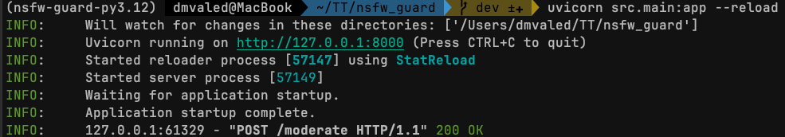
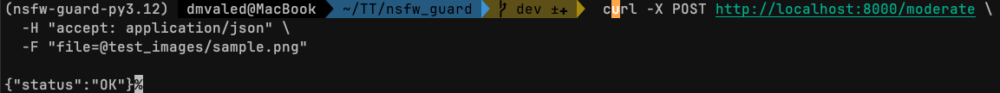

# NSFW Image Moderation API

A simple FastAPI service that detects NSFW content in images using DeepAI's NSFW Detector API.

## 🚀 Features
- Accepts `.jpg` and `.png` image uploads via `POST /moderate`
- Sends images to DeepAI NSFW model
- Returns `{"status": "OK"}` if safe
- Returns `{"status": "REJECTED", "reason": "NSFW content"}` if NSFW score > 0.7

## 📦 Requirements

- Python 3.12+
- [Poetry](https://python-poetry.org/)
- DeepAI API key

## 🔧 Setup

```bash
poetry install
poetry run uvicorn main:app --reload
```

##  Test

```bash
curl -X POST http://localhost:8000/moderate \
  -F "file=@test_images/sample.png"
```

[]()

[]()
